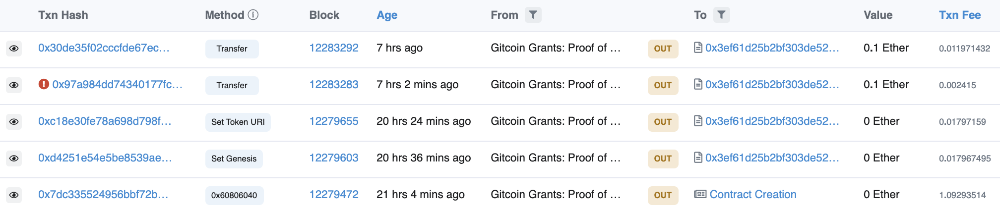
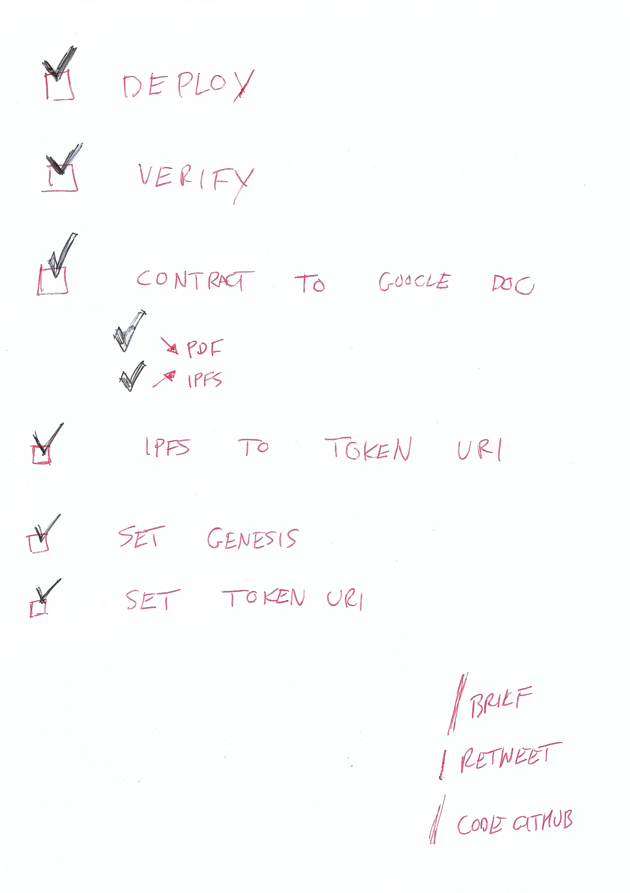

# Network State Genesis - Passport NFT

# V2 (arbitrum)
### `0x7bA6310416B3791CCd967219525b2ceBfCe14CC8`

Split into two contracts to avoid [Metamask warning](https://community.metamask.io/t/whitelist-of-token-contract-addresses-that-legitimately-accept-eth/28963);
* Minter (send ETH here): https://arbiscan.io/tx/0x797a0aa3e8baa148dc0b5eafd2af55bbed6cde341de44180c19e62d503c30842
* Network State Genesis V2: https://arbiscan.io/tx/0xec919e5a4e4c091697e4882a42ccec55a25dfa42be3566940f6448075a2e9688
* Set **GENESIS**: https://arbiscan.io/tx/0x6cedfa8709c4e8c4fedde40a32c918bf760b58d4f750df3a9de9a45b767c5c2d
* Set TokenURI: https://arbiscan.io/tx/0x965d360d24761488b67cfb5901691c9945d23ed7a77ee7658e23a06fb6d65f3e

**GENESIS**: `ipfs://QmRTpvfea5KTWzccDcg4QCLWujJCZuLXg5tqDPj2eKD4Gc`
Token URI: `ipfs://QmT2krEdbjEXr4sH22J955Eo8qBc3kwjdfMTQ7Ee1JATW5`

# V1 (mainnet)

### [`0x3ef61d25b2bf303de52efdd5e50698bed8f9eb8d`](https://etherscan.io/address/0x3ef61d25b2bf303de52efdd5e50698bed8f9eb8d#code)

A few transactions:
* Deployment: https://etherscan.io/tx/0x7dc335524956bbf72b52682de79f319d5bbd8e047c2c44d079515e2e133fd81b
* Set **GENESIS** (the PDF on IPFS that contains the address): https://etherscan.io/tx/0xd4251e54e5be8539ae7370a84ab26c23f87b352770e0faa93b97d7176ef5fba0
* Set TokenURI: https://etherscan.io/tx/0xc18e30fe78a698d798fad7c9291e17f252d109f4aa202db469511d3ff1f29888
* Purchased passport for myself, sanity check, dogfooding: https://etherscan.io/tx/0x30de35f02cccfde67ec990bf3f5bd18c402763fe8ddaa614caa259cfefff135c

* Use 200,000 gas limit (otherwise will run out of gas)
* Use wallet that you control (don't send directly from an exchange)
* MetaMask should be OK, but you'll not see tokens, see this [help page](https://metamask.zendesk.com/hc/en-us/articles/360058238591-NFT-tokens-in-MetaMask-wallet)

### GENESIS

* ipfs://QmYLhBxgdUCCygX5GBB764PwUUQknFBjERmPKu22DfqmFS
* https://gateway.pinata.cloud/ipfs/QmYLhBxgdUCCygX5GBB764PwUUQknFBjERmPKu22DfqmFS

### TokenURI

* ipfs://QmVTbit5XrcnCHbg1XFLdCd9fVJGUrUnmRSGWFWGYKEtga
* https://gateway.pinata.cloud/ipfs/QmVTbit5XrcnCHbg1XFLdCd9fVJGUrUnmRSGWFWGYKEtga

# Code / Audits / Testing

* Using OpenZeppelin as a base
* The custom code is relatively simple
* Automated test: `truffle test`

# Preserving historical value

YouTube video of Mars talking throughout the deployment: https://youtu.be/7MlUj2zU2p4

